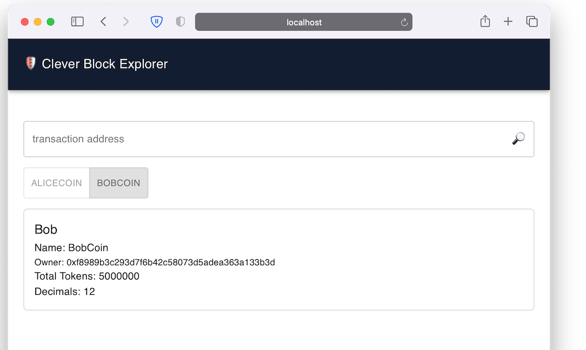
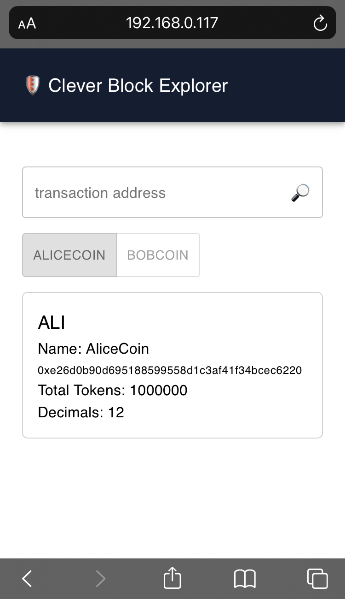

# Clever Block Explorer

This project was created using react, typescript, and zilliqa dev api

### Mobile

## Features
- Single page app the shows coin metetdata information
- Can toggle between Alice and Bob coins
- Search feature to be able to search other tokens by connecting to zilliqa dev api
- Chart sections to show the balances
- Error handling to handle invalid address
- Responsive web application

## Installation and Running
- First thing type `npm install` in the console
- once done type `npm start` next
- a new browser will open under `http://localhost:3000`

## To use 
- By default there are two coin on which can be toggled Alice and Bob coin
- Click on the toggle button to toggle the information between Alice and Bob coin
- A search bar is located at the top, enter a coin address to search example: `0x062dc97aa05a208ec1224a405a53a03d4977ff7f`
- All coin info also comees with balances chart locates at last section of the page.

